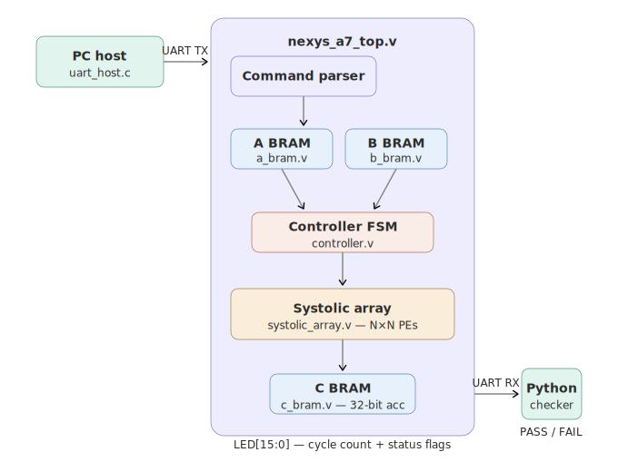
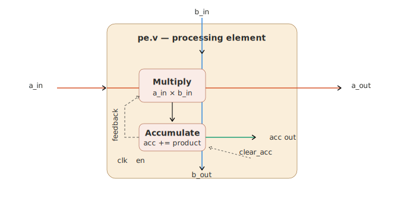
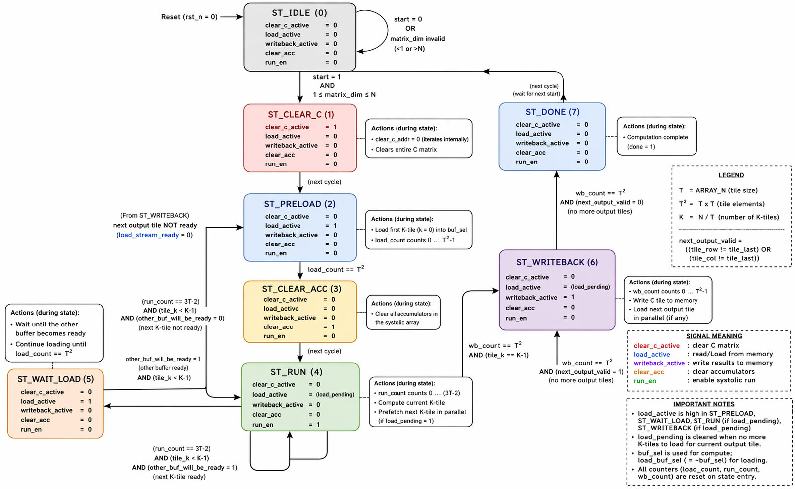

# FPGA-Based Tensor Processing Unit — Systolic Array Matrix Accelerator

A fully pipelined, BRAM-backed systolic array accelerator for signed N×N matrix multiplication, implemented in SystemVerilog and deployed on the **Nexys A7-100T** FPGA. The design uses diagonal (skewed) data feeding, a tiled FSM controller, and a PC-side C host over UART to offload and verify results end-to-end.

---

## Table of Contents

- [Project Overview](#project-overview)
- [Key Features](#key-features)
- [Architecture](#architecture)
  - [Top-Level Data Flow](#top-level-data-flow)
  - [Systolic Array and Diagonal Dataflow](#systolic-array-and-diagonal-dataflow)
  - [Processing Element (PE)](#processing-element-pe)
  - [Controller FSM](#controller-fsm)
  - [UART Command Interface](#uart-command-interface)
- [File Structure](#file-structure)
- [Module Reference](#module-reference)
- [Quick Start](#quick-start)
  - [Simulation](#simulation)
  - [FPGA Run](#fpga-run)
- [UART Protocol](#uart-protocol)
- [LED Status Map](#led-status-map)
- [Reset Behavior](#reset-behavior)
- [Parameters](#parameters)
- [Verification](#verification)

---

## Project Overview

This project implements a **TPU-inspired systolic array** that multiplies two signed 8-bit N×N matrices on an FPGA and returns the 32-bit accumulator output over UART. The target is N ≤ 8 with a default of N = 8.

---

## Key Features

- Parameterized N×N matrix multiply with default runtime `N=32` on an `8×8` physical array
- Diagonal (skewed) data feeding for correct wavefront timing
- Tiled FSM controller supporting matrices larger than the physical array
- BRAM-backed storage for A, B, and C matrices
- DSP-mapped multiply-accumulate in every PE
- Active-low asynchronous reset from the board's `CPU_RESETN` button
- Full UART command/response protocol for host communication
- Burst and zero-run UART loaders to reduce host-to-FPGA transfer overhead
- PC-side C host program (Windows and Linux) with built-in result verification, batching, and BRAM reuse
- Python checker for software-reference verification
- Hardware profiler with stage-cycle counters, overlap metrics, buffer-swap counts, and result signature
- Stage-aware LED dashboard plus a post-run signature/health summary on the FPGA board

---

## Architecture

### Top-Level Data Flow



1. The PC C host generates or reads matrix A and matrix B.
2. It sends them over UART using framed commands, bursts, and optional zero-run compression.
3. `nexys_a7_top.v` receives the stream and writes elements into A BRAM and B BRAM.
4. The host sends a START command; the controller FSM begins execution.
5. The systolic array performs tiled multiply-accumulate over all tiles.
6. Results accumulate into C BRAM.
7. The host polls status, optionally reads the hardware profiler, then issues a DUMP command to read matrix C back.
8. The host and Python checker both recompute A×B in software and confirm correctness.

---

### Systolic Array and Diagonal Dataflow

The array is an ARRAY_N × ARRAY_N mesh of processing elements. Inputs are **skewed** so that each diagonal of A and B arrives at the correct PE at the correct clock cycle.

```
Cycle 0:   A[0][0] enters row 0,  B[0][0] enters col 0
Cycle 1:   A[0][1] enters row 0,  A[1][0] enters row 1
           B[1][0] enters col 0,  B[0][1] enters col 1
Cycle 2:   All diagonals shift one step further right / down
...
```
Data flow inside the mesh (4×4 example):


A values flow RIGHT (horizontally), forwarded by each PE.
B values flow DOWN  (vertically),  forwarded by each PE.
Each PE accumulates:  acc += a_in × b_in

After `(2 × ARRAY_N − 1)` run cycles the last diagonal has drained and every PE holds its final partial sum. The controller then reads out all accumulator values and writes them to C BRAM.

For matrices larger than ARRAY_N the controller tiles the computation: it loops over `tile_row`, `tile_col`, and `tile_k`, clearing the PE accumulators between tiles and accumulating partial results into C BRAM.

---

### Processing Element (PE)

Each PE is the innermost compute unit:



- On every enabled clock: `acc <= acc + (a_in × b_in)`
- `clear_acc` resets the accumulator to zero at the start of each new tile_k pass
- The multiply path is written to infer DSP48 slices

---

### Controller FSM



| State            | Action                                                                                                           |
|------------------|----------------------------------------------------------------------------------------------------------------- |
| `ST_IDLE`        | Waits for `start`. Validates `matrix_dim`. All control signals = 0.                                              |
| `ST_CLEAR_C`     | Clears entire C matrix (`clear_c_active = 1`). Iterates over all C addresses.                                    |
| `ST_PRELOAD`     | Loads first K-tile (k=0) into buffer. `load_active = 1`, counts 0 → T²−1.                                        |
| `ST_CLEAR_ACC`   | Clears all PE accumulators (`clear_acc = 1`).                                                                    |
| `ST_RUN`         | Enables systolic computation (`run_en = 1`). Runs for `(3T−2)` cycles. Prefetch next tile if `load_pending = 1`. |
| `ST_WAIT_LOAD`   | Waits until next buffer is ready (`other_buf_will_be_ready`). Continues loading if needed.                       |
| `ST_WRITEBACK`   | Writes computed tile to C (`writeback_active = 1`). Also loads next output tile if available.                    |
| `ST_DONE`        | Asserts `done = 1`. Waits for next `start` or reset.                                                             |

Asynchronous reset from any state returns immediately to `ST_IDLE`.

---

### UART Command Interface

All host-to-FPGA frames are 5 bytes:

```
[ 0xA5 | CMD | ARG_HI | ARG_LO | DATA ]
```

| CMD byte | Meaning                   | ARG                    | DATA              |
| -------- | ------------------------- | ---------------------- | ----------------- |
| `0x01`   | Write element into A BRAM | flat index (row×N+col) | signed int8 value |
| `0x02`   | Write element into B BRAM | flat index             | signed int8 value |
| `0x03`   | Start multiply            | N (matrix dimension)   | 0x00              |
| `0x04`   | Query status              | 0x0000                 | 0x00              |
| `0x05`   | Dump C matrix             | 0x0000                 | 0x00              |
| `0x06`   | Dump profiler             | 0x0000                 | 0x00              |
| `0x10`   | Burst write A             | starting flat index    | burst length      |
| `0x11`   | Burst write B             | starting flat index    | burst length      |
| `0x12`   | Zero-run fill A           | starting flat index    | run length        |
| `0x13`   | Zero-run fill B           | starting flat index    | run length        |

FPGA responses:

| Response | Meaning       | Payload                                           |
| -------- | ------------- | ------------------------------------------------- |
| `0x5A`   | ACK           | none                                              |
| `0xE0`   | ERROR         | none                                              |
| `0xA6`   | Status packet | 5 more bytes: flags + 4-byte cycle count          |
| `0xA7`   | Dump packet   | 2-byte N, then N×N × 4-byte signed int32 elements |
| `0xA8`   | Profile packet | flags + N + cycle counters + signature           |

---

## File Structure

```
project_root/
├── rtl/
│   ├── params.vh               # Global parameters
│   ├── pe.v                    # Processing element
│   ├── systolic_array.v        # N×N PE mesh
│   ├── a_bram.v                # Matrix A storage
│   ├── b_bram.v                # Matrix B storage
│   ├── c_bram.v                # Matrix C storage (wider)
│   ├── controller.v            # FSM controller
│   ├── tpu_top.v               # Core top (reusable)
│   ├── uart_rx.v               # UART receiver 8N1
│   ├── uart_tx.v               # UART transmitter 8N1
│   └── nexys_a7_top.v          # Board-level top
├── sim/
│   ├── tb_tpu_top.sv           # Simulation testbench
│   └── output/                 # Testbench dump files (auto-generated)
│       ├── matrix_a.txt
│       ├── matrix_b.txt
│       ├── matrix_c_hw.txt
│       └── run_info.txt
├── vivado/
│   └── create_project.tcl      # Vivado project creation script
├── constraints/
│   └── nexys_a7_top.xdc        # Pin assignments for Nexys A7
├── tools/
│   ├── uart_host.c             # PC-side UART host program
│   └── check_output.py         # Software reference checker
├── fpga_output/                # UART host output files (auto-generated)
│   ├── matrix_a.txt
│   ├── matrix_b.txt
│   ├── matrix_c_fpga.txt
│   └── run_info.txt
└── batch_files/
    ├── build_host.bat          # Compile uart_host.c
    ├── open_vivado.bat         # Launch Vivado with project TCL
    ├── run_fpga_random.bat     # Run FPGA with random matrices
    ├── run_fpga_files.bat      # Run FPGA with file-supplied matrices
    ├── check_sim.bat           # Verify simulation output
    └── check_fpga.bat          # Verify FPGA output
```

---

## Module Reference

| Module               | Purpose                                                                                          |
| -------------------- | ------------------------------------------------------------------------------------------------ |
| `params.vh`          | Defines `DEFAULT_MATRIX_N`, `DEFAULT_ARRAY_N`, `DEFAULT_DW`, `DEFAULT_ACCW`, clock Hz, baud rate |
| `pe.v`               | Single MAC unit; multiplies a_in × b_in, accumulates, forwards a and b                           |
| `systolic_array.v`   | Instantiates ARRAY_N × ARRAY_N PEs, wires the mesh                                               |
| `a_bram.v`           | Synchronous read/write BRAM for signed 8-bit matrix A                                            |
| `b_bram.v`           | Same structure as A BRAM                                                                         |
| `c_bram.v`           | Wider BRAM for accumulator-width matrix C output                                                 |
| `controller.v`       | 7-state FSM; drives load, run, writeback, tile loops, done                                       |
| `tpu_top.v`          | Connects controller, BRAMs, systolic array; exposes host ports                                   |
| `uart_rx.v`          | 8N1 serial receiver, outputs `data_o` / `valid_o`                                                |
| `uart_tx.v`          | 8N1 serial transmitter, inputs `data_i` / `start_i`                                              |
| `nexys_a7_top.v`     | Board wrapper; command parser, LED driver, UART framing                                          |
| `tb_tpu_top.sv`      | Simulation testbench; randomizes inputs, runs DUT, dumps and checks output                       |
| `uart_host.c`        | PC host; generates matrices, communicates over serial, saves output files                        |
| `check_output.py`    | Python checker; recomputes A×B and compares against hardware result                              |
| `create_project.tcl` | Creates Vivado project for xc7a100tcsg324-1 with all sources                                     |
| `nexys_a7_top.xdc`   | Clock, reset, UART, and LED pin constraints for Nexys A7                                         |

---

## Quick Start

### Simulation

**Step 1 :clone the repository   in your system**

```
git clone https://github.com/himanshurajoriyaiitg/TPU_systolic_array.git
```

**Step 2 — Run the terminal in TPU_systolic_array/  .

**Step 3 — run the command make vivado in terminal to make the vivado project **

```
 make vivado
```
**Step 4 — run the behavioural simulation in vivado and to know that the simulation is correct  run the command  **
```
make check-sim
```
Expected output:

```
PASS: 32x32 matrix multiply matches software reference.
```

---

### FPGA Run

**Step 1 — Build the host program** (MSVC `cl`, MinGW `gcc`, or native `gcc`/`clang` on macOS/Linux):

```
make host 
```

**Step 2 — Synthesize and program** the Nexys A7 from Vivado, generate the bitstream and program  the fpga.

**Step 3 — Run with random matrices** (replace `COM5` with your port and the N with the respective size of matrices):

```
 .\tools\uart_host.exe --port COM8 --random --n 32 --seed 1 --out-dir fpga_output --verbose
```

Example with batching, packed uploads, and stationary A reuse:

```
 .\tools\uart_host.exe --port COM8 --random --n 32 --iterations 8 --reuse-a --out-dir fpga_output --verbose
```

Or run with your own matrix files:

```
make fpga-files PORT=COM8 MATRIX_A=input_a.txt MATRIX_B=input_b.txt N=32 
```

**Step 4 — Verify FPGA result:**

```
 make check-fpga
```

Expected output:

```
PASS: 32x32 matrix multiply matches software reference.
```

---

## LED Status Map on fpga board 

During `busy`:

| LED        | Signal |
| ---------- | ------ |
| `LED[3:0]` | live progress / wavefront animation |
| `LED[4]`   | clear-C stage seen for this run |
| `LED[5]`   | preload/load stage seen for this run |
| `LED[6]`   | clear-acc stage seen for this run |
| `LED[7]`   | run stage seen for this run |
| `LED[8]`   | writeback stage seen for this run |
| `LED[9]`   | controller is currently stalled in `ST_WAIT_LOAD` |
| `LED[10]`  | load overlap is active during run or writeback |
| `LED[11]`  | UART TX activity |
| `LED[12]`  | UART RX activity |
| `LED[13]`  | core busy |
| `LED[14]`  | overflow flag |
| `LED[15]`  | heartbeat |

After `done`:

| LED        | Signal |
| ---------- | ------ |
| `LED[3:0]` | low nibble of the hardware result signature |
| `LED[4]`   | done latched |
| `LED[5]`   | overflow flag |
| `LED[6]`   | wait-load cycles were observed |
| `LED[7]`   | load/run overlap was observed |
| `LED[8]`   | at least one buffer swap occurred |
| `LED[9]`   | packed burst loader was used |
| `LED[10]`  | zero-run loader was used |
| `LED[11]`  | writeback stage was seen |
| `LED[12]`  | run stage was seen |
| `LED[13]`  | preload/load stage was seen |
| `LED[14]`  | clear-C stage was seen |
| `LED[15]`  | heartbeat |

---

## Reset Behavior

- **Signal:** `rst_n` (active-low)
- **Board input:** `CPU_RESETN` button
- **Type:** Asynchronous reset, propagates to all modules
- **Effect:** Controller returns to `ST_IDLE` from any state, current run is aborted, cycle counter clears, UART state resets, LEDs return to idle state

---

## Parameters

Defined in `params.vh`:

| Parameter           | Default          | Description                        |
| ------------------- | ---------------- | ---------------------------------- |
| `DEFAULT_MATRIX_N`  | 32               | Maximum supported matrix dimension |
| `DEFAULT_ARRAY_N`   | 8                | Physical systolic array size       |
| `DEFAULT_DW`        | 8                | Input data width (bits)            |
| `DEFAULT_ACCW`      | `2×DW + log2(N)` | Accumulator width (bits)           |
| `DEFAULT_CLK_HZ`    | 100_000_000      | Board clock frequency              |
| `DEFAULT_UART_BAUD` | 921600           | UART baud rate                     |

---

## Verification

The project has two verification paths:

**Simulation path:**

```
tb_tpu_top.sv  ──►  sim/output/  ──►  check_output.py  ──►  PASS / FAIL
```

**FPGA path:**

```
uart_host.c  ──UART──►  FPGA  ──UART──►  uart_host.c  ──►  fpga_output/  ──►  check_output.py  ──►  PASS / FAIL
```

`check_output.py` accepts either three separate files (`matrix_a.txt`, `matrix_b.txt`, `matrix_c.txt`) or a single combined case file with `BEGIN_MATRIX_A / BEGIN_MATRIX_B / BEGIN_MATRIX_C` sections. It recomputes A×B in pure Python and compares element-by-element against the hardware result.
## 🎥 Demo: Systolic Matrix Multiplier on FPGA

[![Watch Demo]](https://youtu.be/aYAY4XJgoHA?si=pIVD2Lrjgreg93ns)
