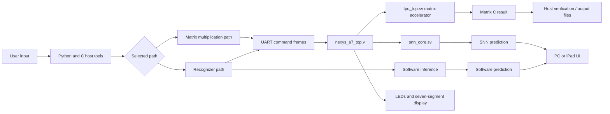
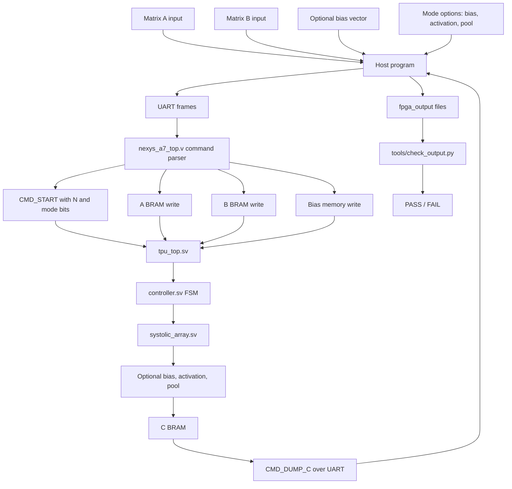
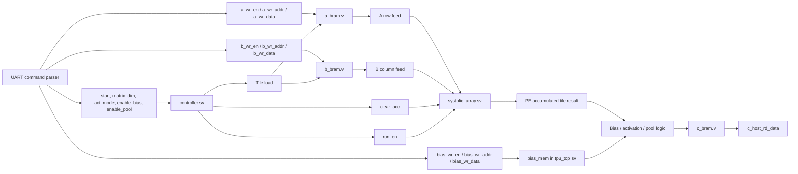
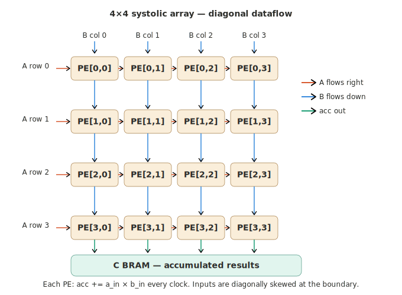
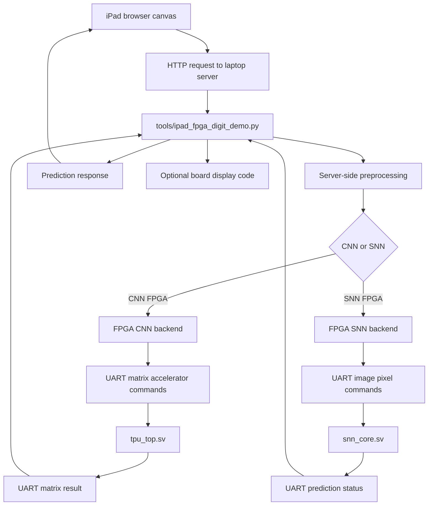

# Project Overview

The FPGA design exposes two hardware compute paths:

1. Matrix accelerator path:
   PC host -> UART -> A/B/Bias memories -> tiled systolic array -> C memory -> UART dump.
2. SNN recognizer path:
   PC/iPad image -> UART image upload -> `snn_core` -> prediction -> UART status/display.

The software tools also support local-only recognizer modes for development,
testing, and comparison before using the board.

## Quick Links

- [Key Features](#key-features)
- [Requirements](#requirements)
- [Recognizer Run Guide](#recognizer-run-guide)
- [Common Setup](#common-setup)
- [Run Recognizer On PC Using Software](#1-run-recognizer-on-pc-using-software)
- [Run Recognizer On FPGA Without iPad](#2-run-recognizer-on-fpga-without-ipad)
- [Run Recognizer On FPGA Using iPad](#3-run-recognizer-on-fpga-using-ipad)
- [FPGA LED Mapping](#fpga-led-mapping)
- [Data Flow](#data-flow)
- [Overall System Data Flow](#overall-system-data-flow)
- [Matrix Multiplication Path](#2-matrix-multiplication-path)
- [Matrix Accelerator Internal Data Flow](#matrix-accelerator-internal-data-flow)
- [Systolic Array and Diagonal Dataflow](#systolic-array-and-diagonal-dataflow)
- [FPGA Recognizer With iPad](#fpga-recognizer-with-ipad)
- [Demo Video](#-demo-video)

## Key Features

- Parameterized signed 8-bit matrix multiply with 32-bit-style accumulation.
- Default maximum matrix size: `N=32`.
- Default physical array size: `ARRAY_N=8`.
- Tiled execution for matrices larger than 8x8.
- Optional bias addition.
- Optional activation: `NONE`, `RELU`, `LEAKY_RELU`.
- Optional 2x2 max pooling.
- UART host support for random matrices, file matrices, batching, reuse, packed bursts, and zero-run compression.
- Python checker for simulation and FPGA output.
- CNN-style handwritten digit/character recognition using the matrix accelerator.
- SNN inference path using `snn_core` and `snn_weights`.
- Browser/iPad drawing demo.
- Vivado project generation through Tcl.

## Requirements

Install these before running the full project:

```powershell
pip install numpy pillow scipy pyserial scikit-learn
```

For FPGA modes you also need:

- Vivado installed and available as `vivado` or `vivado.bat`.
- Nexys A7-100T connected over USB.
- A C compiler for the host program: Visual Studio Build Tools `cl` or MinGW/GCC.
- `make` if you want to use the Makefile shortcuts.

To find the FPGA serial port on Windows:

```powershell
Get-PnpDevice -Class Ports
```

On Linux, check:

```bash
ls /dev/ttyUSB* /dev/ttyACM*
```

Use the discovered port wherever this README shows `COM8`.


# Recognizer Run Guide

This section shows how to run the recognizer in the three required modes:

1. On PC using software
2. On FPGA without iPad
3. On FPGA using iPad

## Common Setup

Install the Python packages once:

```powershell
pip install numpy pillow scipy pyserial scikit-learn
```

For FPGA modes, first create/open the Vivado project:
open the project directory and run 
```powershell
make vivado
```

Then generate the bitstream in Vivado and program the Nexys A7 board.

To find the FPGA serial port on Windows:

```powershell
Get-PnpDevice -Class Ports
```

## 1. Run Recognizer On PC Using Software

This mode runs everything on the laptop. It does not need the FPGA board.

CNN model:

```powershell
make realtime-demo BACKEND=software MODEL=cnn
```

SNN model:

```powershell
make realtime-demo BACKEND=software MODEL=snn
```

You can also classify one built-in template:

```powershell
make char-demo BACKEND=software PIPELINE=template CHARSET=alnum LABEL=A
```

## 2. Run Recognizer On FPGA Without iPad

Use this mode when you want to draw/classify from the laptop, but run inference through the FPGA.

First program the FPGA from Vivado. Then run the PC demo with the FPGA backend.

CNN model through FPGA:

```powershell
make realtime-demo BACKEND=fpga MODEL=cnn PORT=COM8
```

SNN model through FPGA:

```powershell
make realtime-demo BACKEND=fpga MODEL=snn PORT=COM8
```

To classify a single image through the FPGA CNN path:

```powershell
python tools/fpga_cnn_infer.py --backend fpga --port COM8 --charset digits --image-file path\to\digit.png --set-led
```

## 3. Run Recognizer On FPGA Using iPad

Use this mode when the iPad is the drawing interface and the laptop acts as the web server connected to the FPGA.

First program the FPGA from Vivado. Then start the browser demo server on the laptop.

CNN iPad mode:

```powershell
make ipad-demo MODEL=cnn BACKEND=fpga PORT=COM8 HOST=0.0.0.0 WEB_PORT=8000
```

SNN iPad mode:

```powershell
make ipad-demo MODEL=snn BACKEND=fpga PORT=COM8 HOST=0.0.0.0 WEB_PORT=8000
```

You can also run the same command directly:

```powershell
python tools/ipad_fpga_digit_demo.py --model snn --backend fpga --serial-port COM8 --host 0.0.0.0 --http-port 8000
```

Open this address on the iPad browser:

```text
http://<your-laptop-ip>:8000
```

To find your laptop IP on Windows:

```powershell
ipconfig
```

Use the IPv4 address of the Wi-Fi adapter that is on the same network as the iPad i.e 
make sure both the laptop and the ipad is on same wifi network.

For UI testing without the FPGA, run:

```powershell
make ipad-demo MODEL=cnn BACKEND=software HOST=0.0.0.0 WEB_PORT=8000
```

## FPGA LED Mapping
When the recognizer sends `CMD_SET_LED_CODE`, the board displays the predicted label/code:

| Output | Meaning |
| --- | --- |
| `LED[7:0]` | Predicted digit/character code sent by software. |
| `LED[8]` | Valid prediction code is present. |
| `LED[9]` | Done/status indicator. |
| `LED[10]` | Overflow flag from the matrix accelerator path. |
| `LED[11]` | UART transmit activity. |
| `LED[12]` | UART receive activity. |
| `LED[13]` | Recent busy activity. |
| `LED[14]` | Matrix run/load/writeback activity was seen. |
| `LED[15]` | Heartbeat. |
| Seven-segment display | Shows the prediction code when available. |


# Data Flow
## Overall System Data Flow


## 2. Matrix Multiplication Path

### Matrix Multiplication Top-Level Flow



### Matrix Accelerator Internal Data Flow




### Systolic Array and Diagonal Dataflow

The array is an ARRAY_N × ARRAY_N mesh of processing elements. Inputs are **skewed** so that each diagonal of A and B arrives at the correct PE at the correct clock cycle.

```
Cycle 0:   A[0][0] enters row 0,  B[0][0] enters col 0
Cycle 1:   A[0][1] enters row 0,  A[1][0] enters row 1
           B[1][0] enters col 0,  B[0][1] enters col 1
Cycle 2:   All diagonals shift one step further right / down
...
```
Data flow inside the mesh (4×4 example):



A values flow RIGHT (horizontally), forwarded by each PE.
B values flow DOWN  (vertically),  forwarded by each PE.
Each PE accumulates:  acc += a_in × b_in

After `(2 × ARRAY_N − 1)` run cycles the last diagonal has drained and every PE holds its final partial sum. The controller then reads out all accumulator values and writes them to C BRAM.

For matrices larger than ARRAY_N the controller tiles the computation: it loops over `tile_row`, `tile_col`, and `tile_k`, clearing the PE accumulators between tiles and accumulating partial results into C BRAM.

---

A values move horizontally across each row. B values move vertically down each column. Each PE performs:

```text
accumulator = accumulator + a_in * b_in
```


## FPGA Recognizer With iPad


## 🎥 Demo Video

[](https://www.youtube.com/watch?v=Vqjhe0MYNfY)
